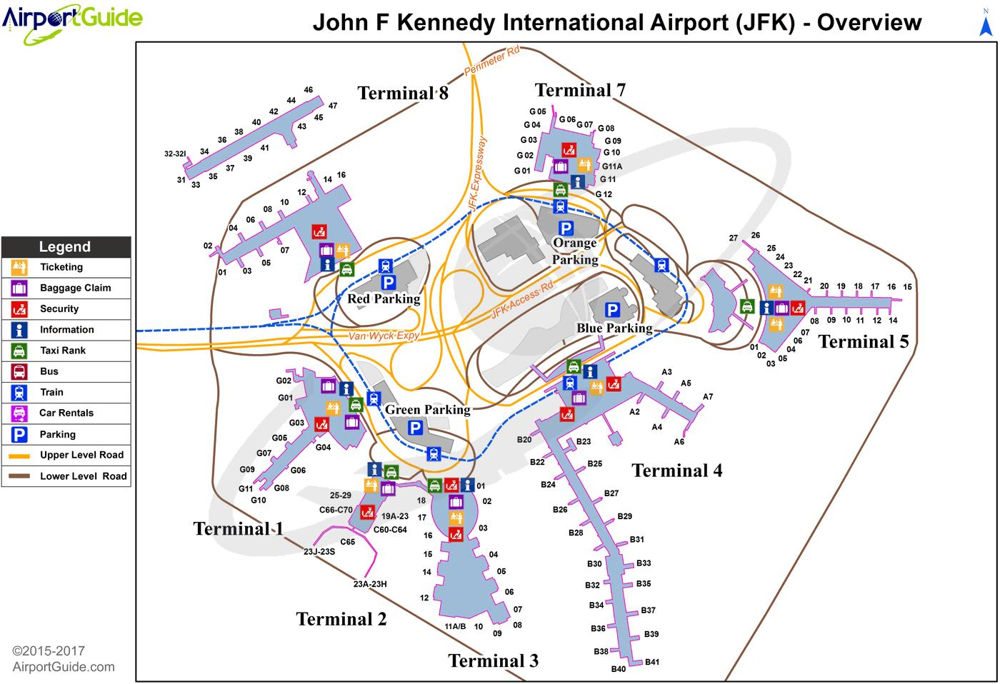

```{r load_packages, include = FALSE}
library("papaja")
```

```{r analysis_preferences}
# Seed for random number generation
set.seed(42)
```
# Introduction
An international airport is the most populated and busiest travel location to move people around the world. Gate assignment is an imperative task for an airports ground operations; and the search for an optimal assignment of flights to gates is of great importance to eliminate delays, maintain operations with high efficiency and reasonable arrangement, and to maximize profits. It is significant to notice that flight delays and cancellations have a negative impact on airport performance and do not provide an excellent experience to travelers. This project aims to propose a new airport gate assignment method to effectively improve the comprehensive operations capacity and efficiency. The project will also aid in optimizing the number of gates allocated to airline carriers to improve the travelers experience.

Airplanes are parked at gates (in the apron) and where passengers wait to board and disembark from these planes. Airports managed gates though a negotiation with the airline carrier who request or advise airports to set aside a certain number of gates (called gate allocations) for dates in the upcoming seasons. In North America, seasons are divided between the summer months (May to Oct) and winter months (Nov to April). These negotiations are based on these two seasons. Airports prepare gate allocations based on the relationship with the airlines, their flight history, their delay or cancellation profiles, etc. Airports will analyze the data, assign the appropriate number of gates and advise the airline of their gate allocations. Airlines will develop their flight route schedules which will be made available to the public through their websites, travel sites, T.V. commercials, etc.; and Airports will do their resource planning according to the airlines schedule. Airports budget for personnel, get the necessary systems or services for systems, even spend for new facilities that need to be built around this schedule if needed with a CAPEX program. Sometimes, an airport may shuffle airlines around gates and when other airlines are affected, airports will work with these airlines.

The project will look at John F. Kennedy International Airport (JFK).  JFK is located in the neighborhood of Jamaica in the borough of Queens, in New York, 30km (16 miles) southeast of Midtown Manhattan. One of the busiest international air passenger airports into North America and the sixth busiest airports in the United States with close to 60 million passengers using the facility, the airport features six passenger terminals and four runways. Our research will focus on one specific operation, the optimization of gate management at JFK. The primary focus is to determine how the passengers are affected by delays and cancellations, and develop a mathematical model based on data analysys in order to maximize the number of passengers served through gates.

# Competitive Analysis
The area of airport gates assignment optimization is well researched. Several researches were aiming to solve the problem considering multiple factors, like cost, passenger walking distances, networking of connected flights etc.

In one research [@azmi_solving_2016], in order to solve discrete optimization problem, the SKF algorithm is combined with angle modulated approach. Airport gate allocation problem refers to the search for optimal assignment of flights to gates at an airport. Assignment of flight to gates has become very complex nowadays, especially for a big size airport. In this study, the airport gate allocation problem is solved using a recently introduced angle modulated simulated Kalman filter (AMSKF). The objective of this study is to minimize the total walking distance. A small case study with 14 flights and 16 gates has been chosen. Preliminary results show that SKF is a promising algorithm for solving the airport gate allocation problem.

Another paper [@barnhart_demand_2012] summarizes research trends and opportunities in the area of managing air transportation demand and capacity. Capacity constraints and resulting congestion and low schedule reliability currently impose large costs on airlines and their passengers. Significant capacity increases that would solve these problems are not expected in the near- or medium-term. This paper outlines first a number of directions for effecting improvement through marginal capacity increases and better management of demand and available capacity. It describes strategic initiatives that airlines and civil aviation authorities might undertake over time horizons of months to years as well as tactical measures that may be adopted on a daily basis in response to dynamic, real-time developments like poor weather or schedule disruptions. Research challenges in these areas are identified and classified in terms of specifying, allocating, and utilizing capacity. The first two categories reject challenges faced by infrastructure providers, the last category challenges faced by airlines.

Others[@bihr_conceptual_1990] think that positioning of incoming flights should take into account the distribution of passengers among connecting flights. The larger the number of passengers arriving on flight X for destination A, the closer flight X should be positioned to the flight departing for A. This inquiry looks conceptually at this problem, reducing the distance passengers must walk from gate to gate. The criterion selected is minimization of the total passenger-distance travel for a given arrival-departure cycle. The problem can be conveniently cast as a 0,1 Linear Programming (LP) problem].

Another paper [@ding_airport_nodate] studies the over-constrained Airport Gate Assignment Problem, where the objectives are to minimize the number of ungated flights and the total walking distances or connection times. They approach the problem by first using a greedy algorithm to minimize ungated flights and by developing exchange moves which then facilitate the use of heuristics. Simulated Annealing and a hybrid of Simulated Annealing and Tabu Search are used.

Airport gate assignment is of great importance in airport operations. In the paper [@li_airport_nodate], the authors studied the Airport Gate Assignment Problem (AGAP), propose a new model and implement the model with Optimization Programming language (OPL). With the objective to minimize the number of conflicts of any two adjacent aircrafts assigned to the same gate, the authors build a mathematical model with logical constraints and the binary constraints, which can provide an efficient evaluation criterion for the Airlines to estimate the current gate assignment. To illustrate the feasibility of the model the authors construct experiments with the data obtained from Continental Airlines, Houston Gorge Bush Intercontinental Air-port IAH, which indicate that our model is both energetic and effective. Moreover, the authors interpret experimental results, which further demonstrate that the proposed model can provide a powerful tool for airline companies to estimate the efficiency of their current work of gate assignment.

To help researched see how airports are performing with FlightStats monthly On-time Performance Report, the report [@noauthor_airline_nodate] compares the on-time arrival performance of major and regional airports around the world.
The [@noauthor_data_nodate] report presents Load Factor (passenger-miles as a proportion of available seat-miles in percent ) for All Carriers and All Airports. Optimizing gate assignments at airport terminals is analysed in this article [@noauthor_optimizing_1998]. Airline On-Time Statistics and Delay Causes is presented here [@noauthor_ost_r_nodate].

The research [@riedel_approach_2006] presents an approach for predicting operational performance of airlines on the basis of flight schedules and aircraft assignments. The methodology uses aggregate measures of properties of aircraft assignments, called Aircraft Assignment Key Performance Indicators (KPIs), and aims to find correlations between them and the operational performance of the airline. A simulation experiment is prepared to gather a large set of data points for analysis. A motivation is given for the use of control theoretic approaches in airline operations to utilize the KPIs as a basis for initial planning and corrective actions.

# Proposed Plan
The focus of this study will be one of the major US airports - either John F. Kennedy Airport in New York or San Francisco Airport (SFO) depending on the data availability. The study will analyze airline gate operations performance measures over a 1997 to 2008 of publicly available data from bureau of transportation statistics. As an example - JFK Airport is located in the neighborhood of Jamaica in the borough of Queens, in New York, 30km (16 Miles) southeast of Midtown Manhattan. One of the busiest international air passenger airports in North America and the sixth busiest airpots in United States with close to 60 million passengers usint the facility a year (2016 data). The airport features six passenger terminals and four runways (see Figure\ \@ref(fig:jfk)). More than ninty airlines operate at JFK Airport using the more than 128 gates across six terminals. The focus of the research is to determine the effects of airlines' performance on airport gate utilization. 

```{r jfk, fig.cap = "CRISP-DM Process Diagramm.", fig.align = "center", out.width = "0.75\\textwidth", fig.pos = "!h"}

```

## Data Insights
Information from 22 years has been retrieved from airlines transportation database. These datasets are from 1987 to 2008 and are relative to United State airlines performance, for the data description (see Table 1). As an example, for the year 2008, JFK airport has 118.804 flights from 11 different carriers. The top 4 most important carriers are JetBlue Airways with 45% of total traffic followed by Comair Inc. (16%), Delta Air Lines (14%) and American Airlines Inc. (10%). Number of flights per carrier at New York John F. Kennedy Airport (JFK) presented here (see Tables 2,3 and 5). For that analysis the following datasets were analyzed:

 - Airline on-time performance reports [@noauthor_airline_nodate];
 - 1987-2008 US Flights statistics [@noauthor_data_nodate];
 - SFO Gate and Stand Assignment Information [@noauthor_sfo_nodate];
 - 2015 US Flights statistics [@noauthor_2015_nodate];
 - Aircraft registry [@noauthor_aircraft_nodate].

## Model estimation
Our research will focus on the impact of this delays and cancellations to the airport.  What our research goal is to answer the following questions:

 - What are the impacts of airline delays on gate management  specifically on the following:
    - What is the current baseline of delay and cancelled events in terms of number of instances, flights and instances (Quantify and create a baseline)
    -	Which airlines cause these delays?
    -	What are the causes of these delays?
    - What is the impact of these delays into gate utilization
    - What is the estimated number of passengers affected by delays and cancellations
    - In the ballpark, what are the the financial costs, of delays and cancellation

 - What is the future forecasted airline delays  
    - Using historical data and linear progressing, what will be the estimated future delays and cancellations in the next 5, 10, 20 years?
    - Combining historical data and using scenario analysis of varying growths for each airlines, what is the estimated future delays and cancellations in the next 5, 10, 20 years  using Monte Carlo Analysis
    - What is the estimated the potential impact of number of customers affected and financial costs of these future delay s and cancellations
 - What should the airport consider as options to address potential future scenarios?

As the result of this analysis we are planning to build a model based on one of the variations of Linear Programming to optimize the gate allocation. The required for that methodology cost function will be developed after thorough data analysis where we are planning to use Linear Regression to extract behaioral parameters of airlines from the historical data.

## The process
For the development of this project we are using CRoss-Industry Standard Process for Data Mining (CRISP-DM) (see Figure\ \@ref(fig:crisp-dm)) was developed by Daimler Chrysler (then Daimler-Benz), SPSS (then ISL) and NCR in 1999. Compiling the current proposal document is a part of this process (see Table 2), in it's preparation our team has conducted 2 iteration of the CRISP-DM process.

```{r crisp-dm, fig.cap = "CRISP-DM Process Diagramm.", fig.align = "center", out.width ="0.75\\textwidth"}
knitr::include_graphics("../../images/CRISP-DM_Process_Diagram.png")
```

# Potential Risks
Use of assumptions including past performance to predict future performance.  Simplifying cost estimates such as aggregate load factors and blended costs.  Reliance of public data without management inputs.  Data did not exclude normalization of data for abnormal, one-time events.

# Cost/benefit analysis
Understanding gate performance of airlines enable airport management to proper plan airline gate assignments optimally that reduces lost revenues, maximizes the use of gate facilities and defers/avoids expansion of capex due to inefficient use. 

If airlines perform as what was agreed with the airport, then the gates are managed optimally. However, there are instances when a number of flights, get delayed or even cancelled.  There are various reasons for these delays.  It could be the weather-related, security reason, or natural calamity or sometimes it is the airline (i.e. bad plan, route did not have enough passenger, labour strike, non-payment of leases (these planes are mostly leased financed). 

When there is a delay or cancellation, the impact is two-fold from the point of view of the airport.  First, customer (passenger) experience suffers.  The second is that the airport would incur both actual cost (the personnel it hired, capex spent if applicable, deicing, electricity, use of systems, etc.), revenue lost (landing fees, terminal fees), and opportunity cost (airport could have given that particular gate to another airline).

From the point of the airlines, it is similar but the customer experience is more palpable than the airports.  Typically, passengers view delays as the fault of airlines not airports (unlike delays in baggage retrieval is faulted to the airport when it is actually more of the airline).  The airline also suffers financially such as cost of transporting the baggage and hotel accommodation, salaries for pilot and crew members, jet fuel costs, etc.

# Conclusion
Airports perform complex operations that involve close coordination between the airlines, passengers and airport authority. Optimizing gate operations benefit all these stakeholders; Airlines can avoid the direct cost of delays. Passengers are able to have a better airport experience. Airports are able to maximize the use of gate facilities and avoid unnecessary capital builds.

\newpage

# References
```{r create_r-references}
r_refs(file = "r-references.bib")
```
\begingroup
\setlength{\parindent}{-0.5in}
\setlength{\leftskip}{0.5in}

<div id = "refs"></div>
\endgroup

\newpage

# Tables

---
output: pdf_document
---

| Name              | Description                                     |
|-------------------|-------------------------------------------------|
| Year              | 1987-2008                                       |
| Month             | 1 - 12                                          |
| DayofMonth        | 1 - 31                                          |
| DayOfWeek         | 1 (Monday) - 7 (Sunday)                         |
| DepTime           | actual departure time (local, hhmm)             |
| CRSDepTime        | scheduled departure time (local, hhmm)          |
| ArrTime           | actual arrival time (local, hhmm)               |
| CRSArrTime        | scheduled arrival time (local, hhmm)            |
| UniqueCarrier     | unique carrier code                             |
| FlightNum         | flight number                                   |
| TailNum           | plane tail number                               |
| ActualElapsedTime | in minutes                                      |
| CRSElapsedTime    | in minutes                                      |
| AirTime           | in minutes                                      |
| ArrDelay          | arrival delay, in minutes                       |
| DepDelay          | departure delay, in minutes                     |
| Origin            | origin IATA airport code                        |
| Dest              | destination IATA airport code                   |
| Distance          | in miles                                        |
| TaxiIn            | taxi in time, in minutes                        |
| TaxiOut           | taxi out time in minutes                        |
| Cancelled         | was the flight cancelled?                       |
| CancellationCode  | A = carrier, B = weather, C = NAS, D = security)|
| Diverted          | 1 = yes, 0 = no                                 |
| CarrierDelay      | in minutes                                      |
| WeatherDelay      | in minutes                                      |
| NASDelay          | in minutes                                      |
| SecurityDelay     | in minutes                                      |
| LateAircraftDelay | in minutes                                      |

Table: Variable descriptions

\newpage

```{r numf, results = 'asis', echo = FALSE}
flights <- read.csv("../../data/NumFlights .csv", row.names = NULL)
library("papaja")
apa_table(
  flights
  , landscape = FALSE
  , small = TRUE
  , caption = "Number of flights per carrier at New York John F. Kennedy Airport (JFK)."
  , note = "Month,JetBlue Airways (B6), Delta Air Lines Inc. (DL), Comair Inc. (OH), American Airlines Inc. (AA), Continental Air Lines Inc. (CO), American Eagle Airlines Inc. (MQ), United Air Lines Inc. (UA), Northwest Airlines Inc. (NW), US Airways Inc. (US), Mesa Airlines Inc. (YV), Atlantic Southeast Airlines (EV)"
)
```

\newpage

---
output: pdf_document
---

| JetBlue Airways | Delay IN | Delay OUT  |
|----------------------|----------|-----------|
| Jan-08               | 12,802   | 35,088    |
| Feb-08               | 59,040   | 58,630    |
| Mar-08               | 55,435   | 62,378    |
| Apr-08               | 25,965   | 46,178    |
| May-08               | 16,423   | 15,769    |
| Jun-08               | 96,536   | 57,520    |
| Jul-08               | 115,981  | 96,075    |
| Aug-08               | 115,300  | 109,549   |
| Sep-08               | 3,036    | 22,868    |
| Oct-08               | -25,549  | 6,489     |
| Nov-08               | -13,828  | 26,594    |
| Dec-08               | 66,061   | 87,718    |
| | | |
| Total                | 527,202  | 624,856   |

Table: Delay trend IN/OUT in minute for the top (JetBlue Airways) carrier at JFK.

\newpage

---
output: pdf_document
---

| Month  | American Airlines| JetBlue Airways | Delta Airlines  | Comair | Total|
|--------|-----|--------|-----|--------|-------|
| Jan-08 | 30  | 55     | 16  | 63     | 164   |
| Feb-08 | 42  | 113    | 27  | 130    | 312   |
| Mar-08 | 24  | 72     | 22  | 83     | 201   |
| Apr-08 | 36  | 42     | 6   | 36     | 120   |
| May-08 | 19  | 10     | 7   | 22     | 58    |
| Jun-08 | 21  | 141    | 14  | 84     | 260   |
| Jul-08 | 41  | 188    | 29  | 193    | 451   |
| Aug-08 | 20  | 197    | 25  | 203    | 445   |
| Sep-08 | 15  | 63     | 19  | 49     | 146   |
| Oct-08 | 7   | 18     | 8   | 15     | 48    |
| Nov-08 | 2   | 37     | 6   | 33     | 78    |
| Dec-08 | 18  | 127    | 30  | 121    | 296   |
|--------|-----|--------|-----|--------|-------|
| Total  | 275 | 1,063  | 209 | 1,032  | 2,579 |

Table: Total Cancellations

\newpage

---
output: pdf_document
---

| Phase| Task Name  | Schedule  | Resources | Status |
|--|--|--|--|--|
|Business understanding  || 3 days | All analysts |Completed|	
|Data understanding  |  | 2 days |Business analysts|In progress|
|  | Data collection |  |	|Completed|
|  | Data description |  | |Completed|
|  | Data quality check |  |	|In progress|
|  | Exploratory analysis|  |	|In progress|
|Data preparation  |  | 2 days |Business analysts\Modelers	|In progress|
|  | Selection |  |	|2 iterations|
|  | Cleaning|  |	|2 iterations|
|  | Construction|	|	|2 iterations|
|  | Integration|	|	|2 iterations|
|  | Formatting |	|	|2 iterations|
|Modeling  |  | 5 days|Modelers|Not started|
|  | Generate test design|	|	||
|  | Build model||||
|  | Interpreter model results|  |	||
|  | Model evaluation |  |	|	|
|  | Refine and repeat |  |All analysts	|	|
|Evaluation  |  | 4 days |Modelers|Not started|
|  | Assessment of results  |	|	||
|  | Review of process| |	||
|  | Determine actions|	|	||
|  | Refine and repeat  |	|All analysts	||
|Deployment  |  | 1 day	|Modelers\Project Mng	|Not started|
|  |Deployment plan|	|	Modelers||
|  |Maintenance plan  |	|Project Mng	||
|  |Final report  | |Modelers\Project Mng	||
|  |Review project|	|	Project Mng||

Table: Proposed Plan Phases
